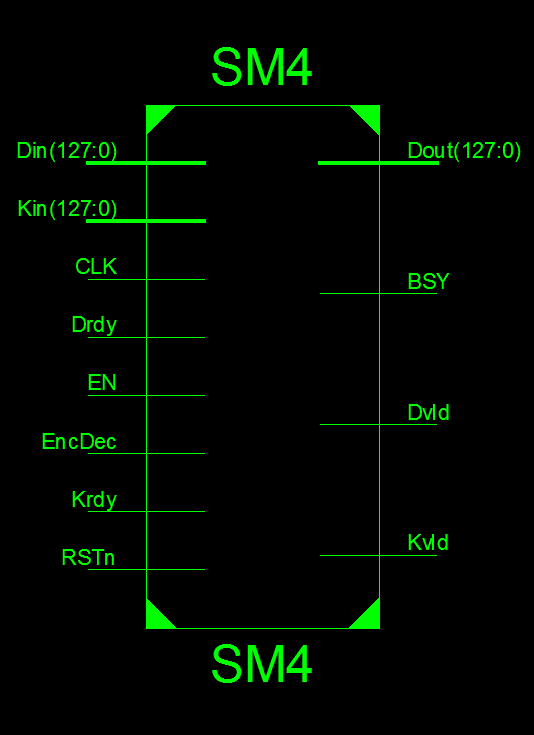
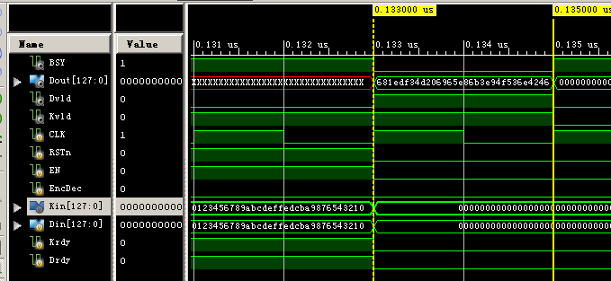

# SM4 Module in Verilog HDL
## Intoduction
Verilog HDL code for SM4 algorithm.

## Module
- Top Module
- Sbox Trans Module
- Trans Round Key Moudle
- Trans EncDec Data Moudle
- One Round Key Expansion Moudle
- One Round Data Enc/Dec Moudle
- Key Expansion Module
- Data Enc/Dec Module

## Interface


| Port | Type | Description |
| :-: | :-: | :-: |
| CLK | INPUT | clock signal |
| RSTn | INPUT | reset signal |
| EN | INPUT | able for sm4 module |
| EncDec | INPUT | 0-Encryption, 1-Decryption |
| Kin | INPUT | Key, 128 bits |
| Din | INPUT | Data for Enc/Dec, 128 bits |
| Krdy | INPUT | ready for key exp |
| Drdy | INPUT | ready for Enc/Dec |
| BSY | OUTPUT | busy signal |
| Kvld | OUTPUT | 32 round keys valid |
| Dvld | OUTPUT | output data (Enc/Dec result) valid |
| Dout | OUTPUT | result |

## Demo
Info:
```
TYPE:     SM4_ENC
KEY_IN:   0123 4567 89ab cdef fedc ba98 7654 3210
DATA_IN:  0123 4567 89ab cdef fedc ba98 7654 3210
DATA_OUT: 681e df34 d206 965e 86b3 e94f 536e 4246
```

Test:


